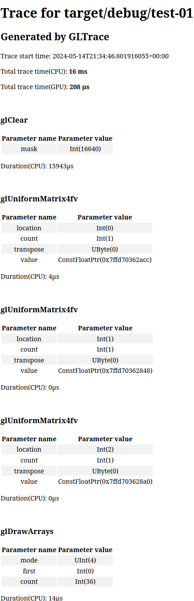

# GLTrace

## OpenGL Tracing Library

This tool allows you trace OpenGL calls, a la `RenderDoc`. The big difference here is that it is integrated directly into your program, instead of launching your program through something like `RenderDoc` or `Nvidia Nsight`. 

This is still a WIP but as it stands it is quite neat I think; and at the very least is a cool tech demo. And it also took me a while to do.

It works by hooking into OpenGL calls using my other library I created for this project: [gl_hooker](https://github.com/lappn99/gl_hooker). Since the hooks it installs perserve the hooked function, and the hooks themselves call the hooked function after its done: your program otherwise runs as normal while the tracing is going on, and incurs little overhead.

## Use

> **_NOTE:_** Linux-x86_64 *only* right now.

First the aforementioned [gl_hooker](https://github.com/lappn99/gl_hooker) is required on your system. See install instructions for that. 

Obviously easy integration into the program is the #1 priority for something like this. I believe the API as it stands now is *decent* regarding this but it will probably change.

It seems to work best when using a loading library like [gl_loader](https://github.com/maeln/gl_loader), as the name of each symbol loaded is required too hook into it. Using the example on that page, this is what initialzing the tracer and installing the hooks would look like:

```
extern crate gl_loader;
use gltrace_rs;

fn main() -> Result<(), Box<dyn std::error::Error>> {
    //Needs to happen before you load the functions, obviously.
    let mut gltracer = GLTracer::new()?;
    gl_loader::init_gl();
    gl::load_with(|symbol| {
        if let Err(e) = gltracer.trace_func(symbol) {
            println!("{}",e);
        }
        gl_loader::get_proc_address(symbol) as *const _
    });
    Ok(())

    while(window.should_not_close()) {
        gltracer.tracer.start();
        gl_clear(); //Start trace before this so clearing the screen is included in the trace.

        /*Application code*/

        gltracer.tracer.end(); 
        //Swapping the buffers isn't really an implementation detail that you can really control or is wholly important to debugging and profiling. Usually its used as a demarcation for the boundaries of a 'frame'.
        //As of now it is not traced. Since this can affect performance; including it would make results less accurate as it would affect the `trace end time`, giving wrong results.
        swap_buffers(); 
    }
    

```
The trace can then be written to whatever implements the `fmt::Write` trait, which is input to the very simple `TraceOutputGenerator` trait which takes all the traces and just writes them into the writer. There are two `TraceOutputGenerator's` implemented:

* `TraceHtmlGenerator`, which outputs the trace to formatted HTML
* `TraceTextGenerator`, which just outputs the trace as a text file, with no particular format.

Getting the trace as `HTML` and automatically opening it in your browser:

```
    /*Application code*/
    ^^^^^^^^^^^^^^^^^^^^
    
    let output_file = format!("trace.{}.html", std::process::id());
    let mut trace_file = File::create(&output_file).unwrap();
    let _ = gltracer.trace.write_trace(gltrace_rs::TraceHtmlGenerator, &mut trace_file);
    let output = std::process::Command::new("xdg-open").arg(&output_file).output().unwrap();
    println!("xdg-open status: {}", output.status);
    
    }
```

> **_NOTE:_**  It is not wise to capture the trace of a *whole* program that you expect to run for a while as memory use will wise very quickly. Instead only the trace of a *single* frame should be captured. As of right now, encapsulate your frame with `trace.start()` and `trace.end()` calls respectively.

The output of one frame then may look like this (WIP):



> **_NOTE! IMPORTANT!_** By default it will generate hooks for OpenGL 4.5 with with the `Core` profile. This can be changed by setting the following environment variables:

`GLTRACE_OPENGL_VER_MAJOR`: A single digit number denoting the OpenGL spec *major* verison to use.\
`GLTRACE_OPENGL_VER_MINOR`: A single digit number denoting the OpenGL spec *minor* verison to use.\
`GLTRACE_OPENGL_PROFILE`: A string indicating which OpenGL spec *profile* to use. This can either be "CORE" for the `Core` profile or "COMPAT" for the `Compatibility` profile.

An easy way to do this is to set them in your .cargo/config.toml. As so:

If I wanted to use `3.3 Compatibility` profile:
```
[env]
GLTRACE_OPENGL_VER_MAJOR = "3"
GLTRACE_OPENGL_VER_MINOR = "3"
GLTRACE_OPENGL_PROFILE =  "COMPAT"
```
This can then be verified where ever you configured cargo to output build script stuff. Which should have the line:\
`Generating hooks for OpenGL version 3.3, Compatibility profile`


## Future

1. Playback of trace, with the ability to inspect the calls more closely. 
2. Iron out trace output generation. 
    * It may seem like the design of the `TraceOutputGenerator` is over engineering for such a simple thing. My thought is that different implementations can format the trace output differently. Like one for outputting it in a binary format etc. Basically, to provide a facility to easily extend the library.
3. Capture data buffers/shaders/mappings/textures etc.
    * This is related to #1 and #2. Really just capture *all* the data that is flowing to/from the GPU and store it.
4. Profiler
    * Not only is a trace helpful, but so is performance analysis!
5. Make safer(?)
    * Honestly im surprised that it works as well as it does currently. 

